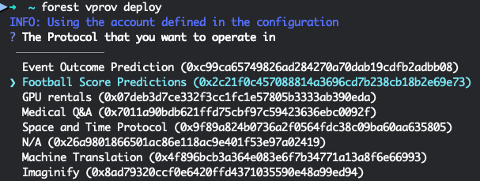
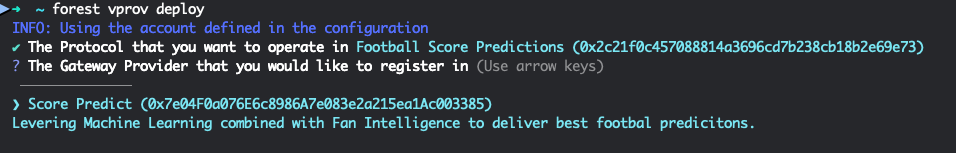
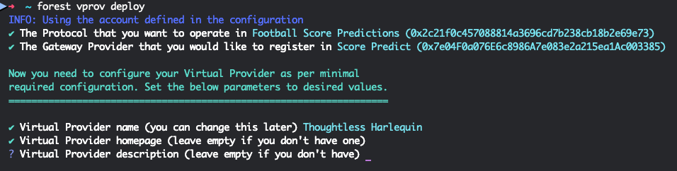
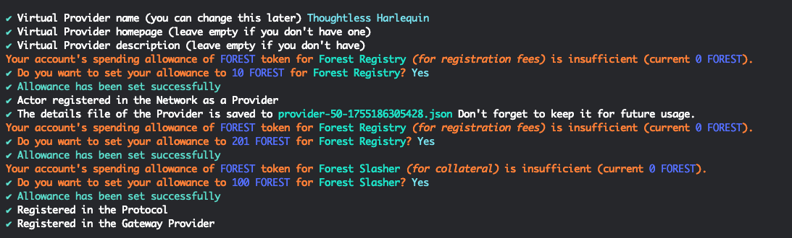
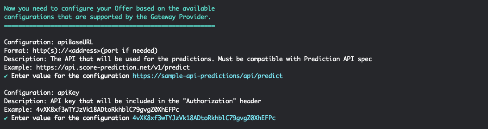
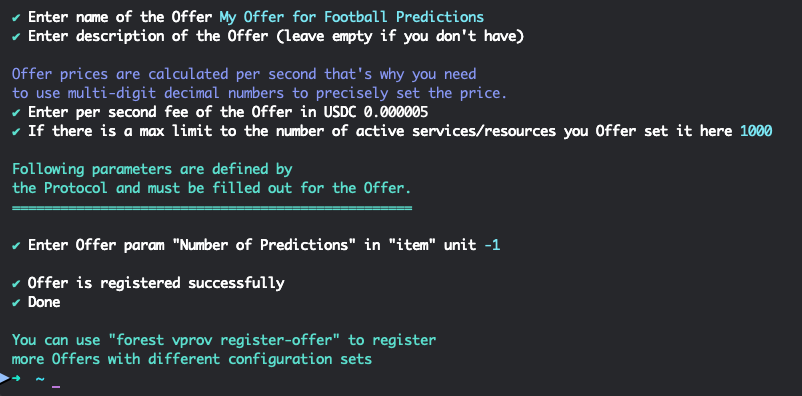

# 📋 Become a Virtual Provider in this Protocol

This Protocol supports Virtual Providers. It means that you don't have to run the ForestAI daemon yourself. Instead there are entities called Gateway Providers that take care of that on your behalf. You just need to register with them and let them know of the API hostname and API key they should use to get Football predictions from your model. 

#### 1. ⚙️ Prerequisites

Install:
- Node.js (min version 22.12.0): [official](https://nodejs.org/en/download) or via (Optional) Node Version Manager: [link](https://github.com/nvm-sh/nvm)
- ForestAI CLI: [official](https://www.npmjs.com/package/@forest-protocols/cli): `npm i @forest-protocols/cli@latest -g`

And set the EVM-compatible private key to be used: `forest config set account 0x69...368b`

#### 2. 🚀 Deploy a Virtual Provider

The CLI provides an interactive step-by-step process for doing a fully-functional deployment of a Virtual Provider by asking a couple of easy questions.

Run the process: `forest vprov deploy`

##### 2.1 Choose This Protocol
Many Protocols support Virtual Providers so in the first step choose `Football Score Predictions` as the one you would like to deploy your Virtual Provider to.

##### 2.2 Choose Your Gateway Provider
Within a Protocol there can be many Gateway Providers to choose from. If you have no preference go with `Score Predict`

##### 2.3 Set Provider Details
Now set your name, homepage and description. Only the name is a mandatory field.

##### 2.4 Set Allowance for the ForestAI contracts
As part of the on-chain registration that happens under the hood we need to pay the registration fees. This involves setting the so-called allowance. The CLI calculates the amounts automatically so just agree by replying with a `Y`.

Now as the registration was successful you are officially part of ForestAI! Welcome! 🎉

##### 2.5 Set API Details
Now the CLI will ask for the API hostname and the API key. 

##### 2.6 Set Offer Details
Finally you need to set the name, description (optional), max amount of agreements you are able to service at the same time and price of your prediction offering. The price is in USD per second, but we automatically calculate the monthly value for your convenience. Last but not least set "Number of Predictions" to `-1` (this is an upcoming feature that will allow you to control how many predictions can be made every month for the user fee being paid. `-1` stands for unlimited)

#### 3. ✅ Make sure your API works
You are now providing services in Football Score Prediction Protocol. Just make sure your API is online and you're good to earn and prove that you are the best! 💪

#### 4. 📊 Monitor Your Performance and Emissions

Check from time to time how are you doing on the leaderboard. Just go to [stats.forestai.io](https://stats.forestai.io/providers).